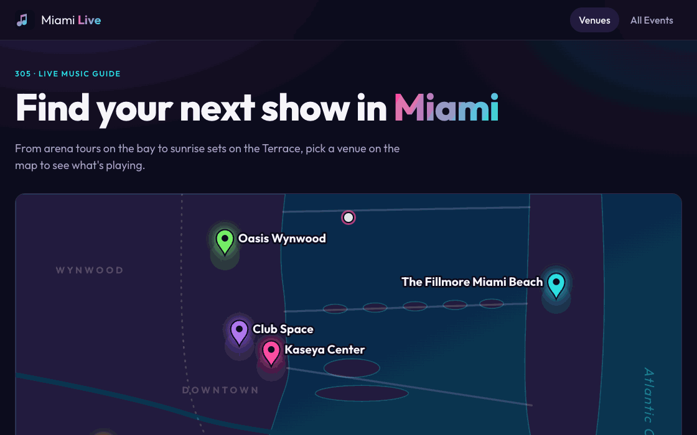

# WEB103 Project 3 - *Miami Live*

Submitted by: **Brandon Delgado**

About this web app: **Miami Live is a virtual community space for Miami's music scene. An interactive map of Miami shows five venues (Kaseya Center, The Fillmore Miami Beach, Ball & Chain, Club Space and Oasis Wynwood). Click a pin or a venue card to open that venue's page and see its upcoming and past shows. An All Events page lists every show in the city, with filters and sorting, and each upcoming show has a live countdown.**

Time spent: **X** hours

## Required Features

The following **required** functionality is completed:

<!-- Make sure to check off completed functionality below -->

- [x] **The web app uses React to display data from the API**
- [x] **The web app is connected to a PostgreSQL database, with an appropriately structured Events table**
  - [ ]  **NOTE: Your walkthrough added to the README must include a view of your Render dashboard demonstrating that your Postgres database is available**
  - [ ]  **NOTE: Your walkthrough added to the README must include a demonstration of your table contents. Use the psql command 'SELECT * FROM tablename;' to display your table contents.**
- [x] **The web app displays a title.**
- [x] **Website includes a visual interface that allows users to select a location they would like to view.**
  - [x] *Note: A non-visual list of links to different locations is insufficient.* 
- [x] **Each location has a detail page with its own unique URL.**
- [x] **Clicking on a location navigates to its corresponding detail page and displays list of all events from the `events` table associated with that location.**

The following **optional** features are implemented:

- [x] An additional page shows all possible events
  - [x] Users can sort *or* filter events by location.
- [x] Events display a countdown showing the time remaining before that event
  - [x] Events appear with different formatting when the event has passed (ex. negative time, indication the event has passed, crossed out, etc.).

The following **additional** features are implemented:

- [x] Interactive SVG map of Miami with venue pins placed from each venue's latitude/longitude. Hovering a pin or a venue card highlights both and shows a preview card.
- [x] The All Events page can also filter by upcoming/past and sort by date, venue or event name. Filters are saved in the URL (e.g. `/events?location=3&when=upcoming`), so a filtered view can be bookmarked or shared.
- [x] Venue pages split events into **Upcoming** and **Past** sections. Past events are greyed out, crossed out and labeled "Event has passed".
- [x] All countdowns run off one shared clock so they tick in sync, and shows starting within 24 hours are labeled "Starting soon".
- [x] Event times always display in Miami time (ET), whatever the viewer's time zone.
- [x] Loading, error and 404 states, including a "Venue not found" page for invalid venue URLs.
- [x] Keyboard-accessible map pins, reduced-motion support and a responsive layout down to phone widths.

## Video Walkthrough

Here's a walkthrough of implemented required features:

<!-- Replace this with whatever GIF tool you used! -->
GIF created with Puppeteer (headless Chrome) and gifenc
<!-- Recommended tools:
[Kap](https://getkap.co/) for macOS
[ScreenToGif](https://www.screentogif.com/) for Windows
[peek](https://github.com/phw/peek) for Linux. -->

## Notes

The main challenge was building a visual way to pick a venue without a mapping library. I drew a simplified map of Miami as an SVG and placed each venue's pin by converting its latitude and longitude into map coordinates, so the pins come straight from the `locations` table. Another challenge was time zones: event times are stored as `TIMESTAMPTZ` with their UTC offsets and always displayed in Miami time, so the countdowns and the "Event has passed" check are correct for anyone viewing the site.

To run locally: add your Render PostgreSQL credentials to `server/.env` (see `server/.env.example`), then run `npm install`, `npm run reset` and `npm run dev`, and open http://localhost:5173.

## License

Copyright 2026 Brandon Delgado

Licensed under the Apache License, Version 2.0 (the "License"); you may not use this file except in compliance with the License. You may obtain a copy of the License at

> http://www.apache.org/licenses/LICENSE-2.0

Unless required by applicable law or agreed to in writing, software distributed under the License is distributed on an "AS IS" BASIS, WITHOUT WARRANTIES OR CONDITIONS OF ANY KIND, either express or implied. See the License for the specific language governing permissions and limitations under the License.
